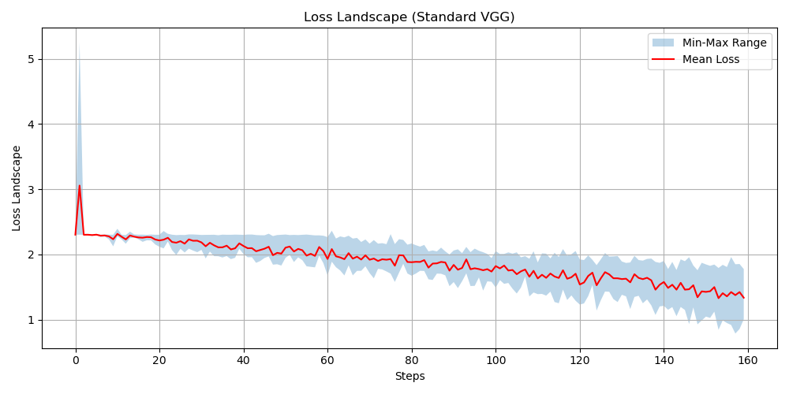
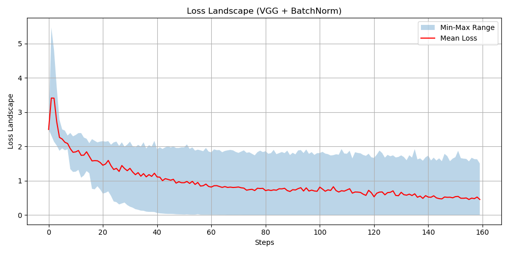
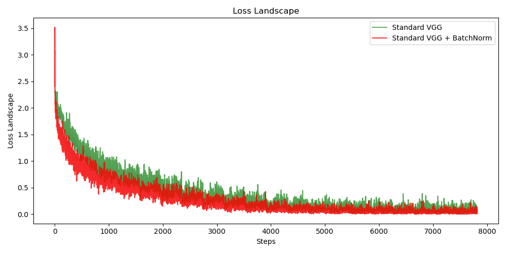

# Project 2: Batch Normalization and Optimization Analysis

## Overview
This project investigates how Batch Normalization (BN) affects the optimization landscape of deep neural networks. We use the CIFAR-10 dataset and a VGG-A architecture to compare:
- **Standard VGG** (without BN)
- **VGG + BatchNorm** (BN layer after every convolution)

We train both models under multiple learning rates, record step-wise losses, and visualize the min–max loss envelopes and mean loss curves.

## Repository Structure
```
.
├── codes
│   └── VGG_BatchNorm
│       ├── data
│       │   └── cifar-10-python.tar.gz
│       ├── models
│       │   ├── vgg.py
│       ├── utils
│       │   └── nn.py
│       ├── loaders.py
│       └── VGG_Loss_Landscape.py
└── README.md
```

## Requirements
- Python 3.7+
- PyTorch
- torchvision
- numpy
- matplotlib
- tqdm

## Installation
1. Clone the repository:
   ```bash
   git clone <your-github-link>
   cd <repo-directory>
   ```
2. (Optional) Create and activate a virtual environment:
   ```bash
   python -m venv venv
   source venv/bin/activate  # Linux/Mac
   venv\Scripts\activate   # Windows
   ```
3. Install dependencies:
   ```bash
   pip install torch torchvision numpy matplotlib tqdm
   ```

## Usage
1. Prepare CIFAR-10 data (automatically downloaded by `loaders.py`).
2. Run the main script:
   ```bash
   cd codes/VGG_BatchNorm
   python VGG_Loss_Landscape.py
   ```
3. Generated loss data and figures will be saved in `reports/figures/` and `losses/`.

## Results
- .
- .
- .

---

## Resources

- **Google Drive (Models)**  
  [Download Trained Models](https://drive.google.com/drive/folders/1nhPALXKxsfLPDJ7yVDPwLUtKowThy3r1?usp=sharing)
